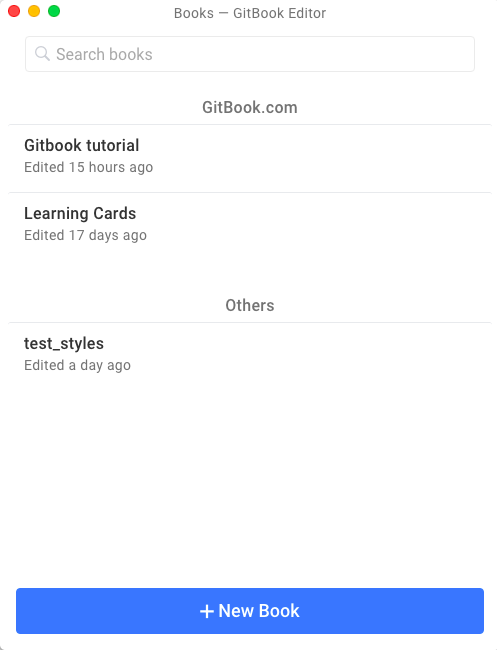
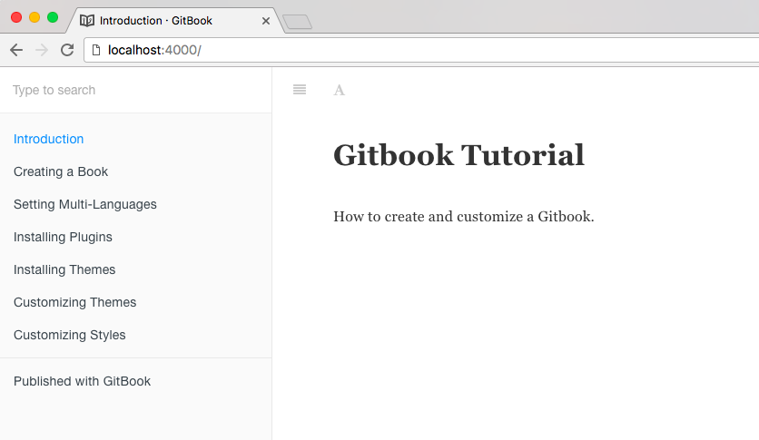

# Creating a book

There are many ways to create a GitBook. The easier way is using the online editor on [GitBook](https://www.gitbook.com/), but to customize, install plugins and themes, it's necessary to work locally. For that you can either import a repo from GitBook or GitHub or, create it with [Gitbook-CLI](https://toolchain.gitbook.com/setup.html).

## GitBook.com

To create it from web just follow the steps on [documentation](https://www.gitbook.com/) and you'll have a book published in less than one minute.

You can check your **git repository url** by clicking on the arrow beside edit button


### Sync with GitHub

In **Settings &gt; GitHub**, you can select a GitHub repository to sync.


First create the repository on GitHub, then you'll be asked to sync the content.

You can choose **which repository will overwrite **the content of the other.

Choose **Force sync using GitBook content **to update the new GitHub repository with the GitBook source code.


## GitBook Editor

Download end install [GitBook Editor](https://www.gitbook.com/editor).

You'll be able to connect to your GitBook account and the editor will import all your books. You can also create a new book locally that you be saved on your home and you can further set a git remote repository.



## Gitbook-CLI

Gitbook-cli is a command line tool to build books. The complete install documentation is available here [https://toolchain.gitbook.com/setup.html](https://toolchain.gitbook.com/setup.html)

The installation is via **NPM**:

```
$ npm install gitbook-cli -g
```

Creating a new book:

```
$ gitbook init
```

Serve the book as a website, it will be served on [http://localhost:4000](http://localhost:4000):

```
$ gitbook serve
```


On the browser:



