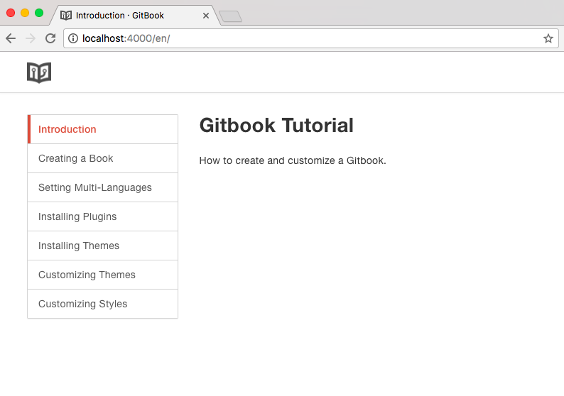

# Installing Themes

A themes is a plugin with templates. They are published with a **-theme **prefix. 

You can search for themes in [plugins directory.](https://plugins.gitbook.com/browse?q=theme)

The installation is the same as a plugin installation, through the file `book.json`:

```
{
    "plugins": ["theme-official"]
}
```

On the terminal:

```
$ gitbook install
$ gitbook serve
```

In the browser, your book will have a new visual.

### Theme-official



### Theme-material


## Themes configuration

Some themes allows configuration, look at the theme's documentation for more information.

Example [https://plugins.gitbook.com/plugin/theme-api](https://plugins.gitbook.com/plugin/theme-api)

`book.json`

```
{
    "plugins": ["theme-api"],
    "pluginsConfig": {
        "theme-api": {
            "theme": "dark"
        }
    }
}
```

### Disable plugins

Some themes, to work properly, require to disable some plugins. To disable a plugin just add a **"-"** before it's name. 

Look at the theme documentation for more information.

Example [https://plugins.gitbook.com/plugin/theme-material](https://plugins.gitbook.com/plugin/theme-material)

`book.json`

```
{
    "plugins": [
        "theme-material",
        "-autotheme",
        "-fancybox",
        "-lunr",
        "-fontsettings",
        "-sharing",
        "-search"
    ]
}
```

Notice that even if you didn't installed any plugin explicitly, some default plugins are automatically loaded.


