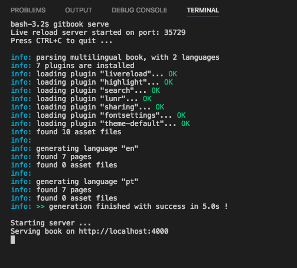
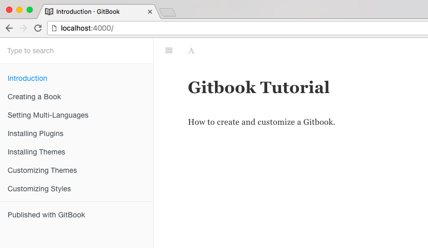

## Gitbook-CLI

Gitbook-cli is a command line tool to build books. The complete install documentation is available here [https://toolchain.gitbook.com/setup.html](https://toolchain.gitbook.com/setup.html)

The installation is via **NPM**:

```
$ npm install gitbook-cli -g
```

Creating a new book:

```
$ gitbook init
```

Serve the book as a website, it will be served on [http://localhost:4000](http://localhost:4000):

```
$ gitbook serve
```



On the browser:



