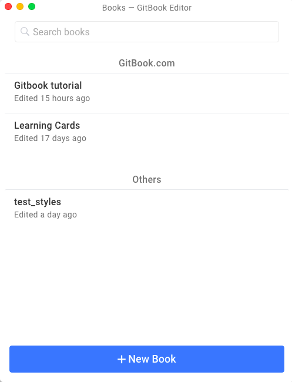

## GitBook Editor

With [GitBook Editor](https://www.gitbook.com/editor) it's possible to work with online and on local repositories.

It connects in a GitBook account and import all GitBook's repositories. You can also create a new book locally, it will be saved on your home and you can further set a git remote repository.

