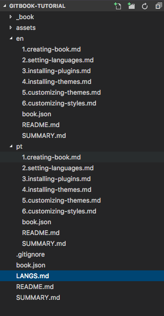
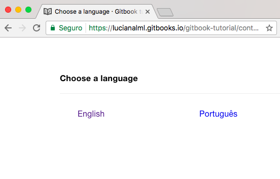

# Setting Multi-Languages

To set up multi-languages, you'll have to change the file structure of the project and create a new file **LANGS.md** in the root folder of the project.

To do this it's better to have the project running locally:

```bash
$ git clone git@github.com:lucianalml/gitbook-tutorial.git
$ cd gitbook-tutorial
```

Now you can open the project folder in any text editor.

Create a new file **LANGS.MD** in the root folder as the example:

```
# Languages

* [English](en/)
* [Português](pt/)
```

Create one folder for each language you'll translate, place the files of the book content inside this folders:



Now when you open your book you'll be asked to choose the language:



For more information take a look at the [documentation](https://toolchain.gitbook.com/languages.html).

