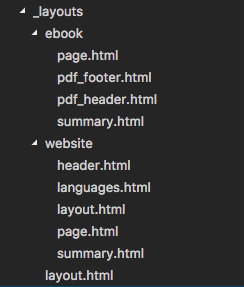
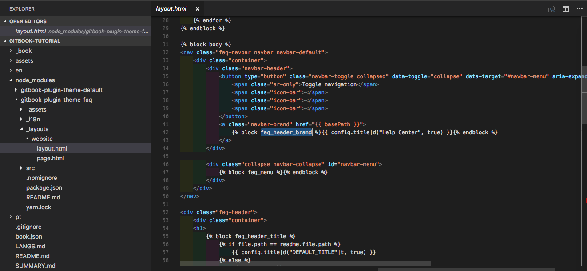

# Customizing Themes

To customize a theme you have to create a new directory `_layouts` in the root folder, or, if you have multiple languages set in the language specific folder.

Inside this directory you can create one directory for each output format that you want to customize the pages, example `_layouts/website`, `_layouts/ebook`.The files inside this folder will overwrite the template of the selected theme.

The file structure can be as the example:




Look at the documentation [https://toolchain.gitbook.com/themes/](https://toolchain.gitbook.com/themes/) for more information.

## Exemple: extending theme-faq

To extend [https://github.com/GitbookIO/theme-faq ](https://github.com/GitbookIO/theme-faq)add the the theme to **book.json:**

```
{
    "plugins": [
        "theme-faq",
        "-fontsettings",
        "-sharing"
    ]
}
```

### Adding logo to header

Extend the theme by creating a file`_layouts/website/page.html`in your book with:

```





```

### Adding navigation links to the header

Extend the theme by creating a file `_layouts/website/page.html`in your book with:

```



<ul class="nav navbar-nav navbar-right">
    <li><a href="#">Contact us</a></li>
    <li><a href="#">Return to SuperWebsite</a></li>
</ul>

```

Look at your **node\_modules** folder to take a look at the theme structure:



